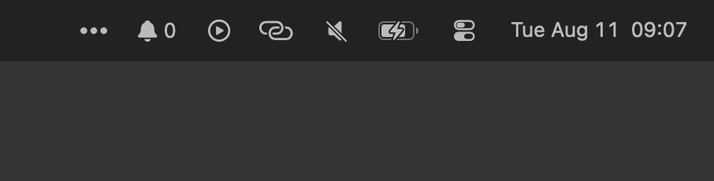

# NotificationCounter

<p align="center">
  
</p>

<p align="center">
  <strong>A tiny native macOS menu bar app that keeps Dock badge counts visible.</strong>
</p>

NotificationCounter shows the total number of active Dock badges in the menu bar. It is useful when you keep the Dock hidden and do not want to move the pointer to the bottom of the screen just to check whether any app badges are waiting.

## Why

Hidden Dock users lose the quick glance signal that Dock badges normally provide. NotificationCounter moves that signal into the menu bar:

- See the total badge count at a glance.
- Open the dropdown to see which apps have badges.
- Click a badge row to activate/open that app.

## Screenshots

| Menu Bar | Dropdown |
| --- | --- |
|  |  |

## Features

- Menu bar bell icon with total Dock badge count
- Dropdown with per-app badge counts
- Per-app icons in the dropdown
- Click a badge row to activate/open that app
- Manual refresh action
- Configurable refresh interval, defaulting to 15 seconds
- Launch at Login toggle
- Settings window with permission and project information
- Native SwiftUI macOS app

## How It Works

NotificationCounter reads badge information exposed by the Dock through macOS Accessibility APIs. It totals the badge counts for apps currently visible to the Dock.

It does not read private Notification Center data, notification contents, messages, emails, or app data. macOS does not provide a public API for third-party apps to inspect every notification shown in Notification Center.

## Permissions

NotificationCounter requires Accessibility permission so it can inspect Dock UI state.

On first run:

1. Open the menu bar item.
2. Choose `Open Accessibility Settings`.
3. Enable `NotificationCounter` in `System Settings > Privacy & Security > Accessibility`.
4. Restart the app if the count does not update immediately.

The app target must have App Sandbox disabled. Sandboxed apps cannot reliably inspect the Dock through Accessibility.

## Build From Source

Open the project in Xcode:

```sh
open NotificationCounter.xcodeproj
```

Then select the `NotificationCounter` scheme, choose `My Mac`, and build/run.

You can also build from Terminal:

```sh
xcodebuild \
  -project NotificationCounter.xcodeproj \
  -scheme NotificationCounter \
  -configuration Release \
  -derivedDataPath ./build \
  clean build
```

The built app will be at:

```sh
./build/Build/Products/Release/NotificationCounter.app
```

## Install Locally

After building a Release app, copy it to Applications:

```sh
cp -R ./build/Build/Products/Release/NotificationCounter.app /Applications/
```

Launch the copy from `/Applications`, then enable Accessibility permission for that installed app.

If you move or rebuild the app, macOS may treat it as a different app path and require Accessibility permission again.

## Limitations

- Counts Dock badge values only.
- Does not count notifications that do not appear as Dock badges.
- Requires Accessibility permission.
- May occasionally produce macOS Accessibility console messages while inspecting Dock UI state.
- Because App Sandbox must be disabled, this is intended for direct distribution rather than Mac App Store distribution.

## Project Status

This is a lightweight personal utility. Contributions and small improvements are welcome.

## Disclaimer

Not one line of code in this project was hand written. The app was built with Codex and Xcode.

Use this app at your own risk. It is provided as-is, without warranty or guarantee of fitness for any purpose.
