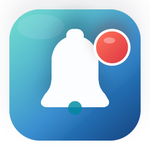
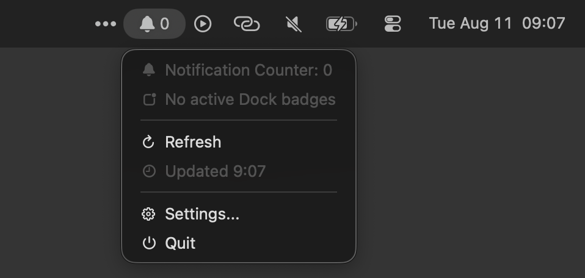

# NotificationCounter

<p align="center">
  
</p>

NotificationCounter is a small native macOS menu bar app that shows the total number of active Dock badges.

The idea came from using a hidden Dock: when the Dock is hidden, checking whether any apps have badge counts means moving the pointer to the bottom of the screen and waiting for the Dock to appear. NotificationCounter keeps that signal visible in the menu bar instead.

## Features

- Menu bar bell icon with the current total badge count
- Dropdown with the total and per-app badge counts
- Manual refresh action
- Settings window
- Configurable refresh interval
- Launch at Login toggle
- Native macOS app built with SwiftUI

## Screenshots




## How It Works

NotificationCounter reads badge information exposed by the Dock through macOS Accessibility APIs. It totals the badge counts for apps currently visible to the Dock.

This app does not read private Notification Center data. macOS does not provide a public API for third-party apps to inspect every notification shown in Notification Center.

## Permissions

NotificationCounter requires Accessibility permission so it can inspect Dock UI state.

On first run:

1. Open the menu bar item.
2. Choose `Open Accessibility Settings`.
3. Enable `NotificationCounter` in `System Settings > Privacy & Security > Accessibility`.
4. Restart the app if the count does not update immediately.

The app target must have App Sandbox disabled. Sandboxed apps cannot reliably inspect the Dock through Accessibility.

## Build

Open the project in Xcode:

```sh
open NotificationCounter.xcodeproj
```

Then select the `NotificationCounter` scheme, choose `My Mac`, and build/run.

You can also build from Terminal:

```sh
xcodebuild \
  -project NotificationCounter.xcodeproj \
  -scheme NotificationCounter \
  -configuration Release \
  -derivedDataPath ./build \
  clean build
```

The built app will be at:

```sh
./build/Build/Products/Release/NotificationCounter.app
```

## Install Locally

After building a Release app, copy it to Applications:

```sh
cp -R ./build/Build/Products/Release/NotificationCounter.app /Applications/
```

Launch that copy from `/Applications`, then enable Accessibility permission for that installed app.

## Limitations

- Counts Dock badge values only.
- Does not count notifications that do not appear as Dock badges.
- Requires Accessibility permission.
- May occasionally produce macOS Accessibility console messages while inspecting Dock UI state.
- Because App Sandbox must be disabled, this is intended for direct distribution rather than Mac App Store distribution.

## Project Status

This is a lightweight personal utility. Contributions and small improvements are welcome.

## Disclaimer

Not one line of code in this project was hand written. The app was built with Codex and Xcode.

Use this app at your own risk. It is provided as-is, without warranty or guarantee of fitness for any purpose.
